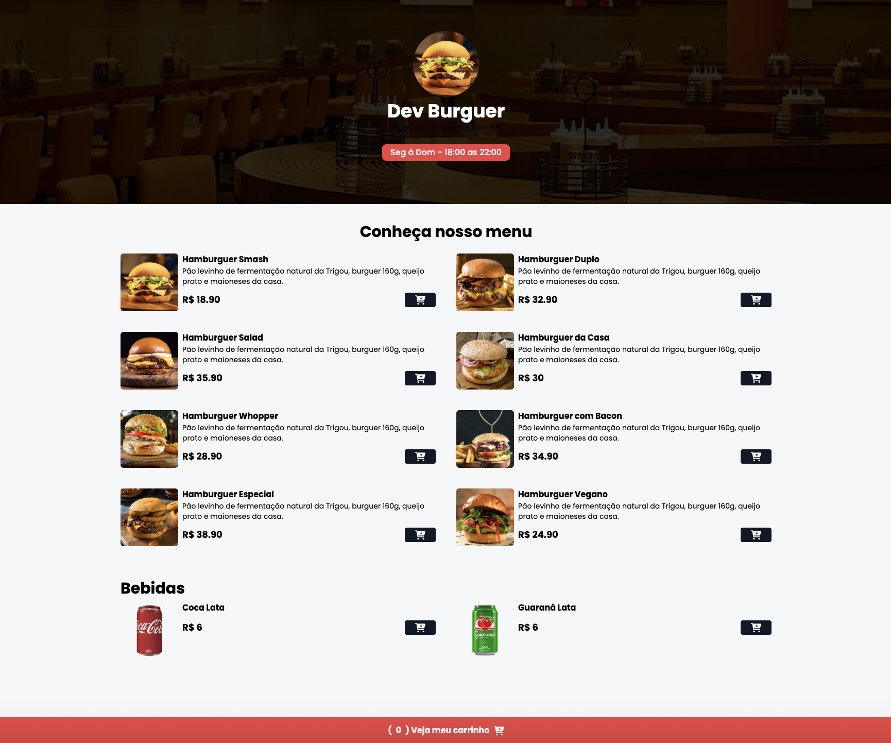

# Dev Burguer 🍔

Bem-vindo ao **Dev Burguer**, o seu novo restaurante preferido que oferece uma experiência gastronômica única com uma interface moderna e interativa. Nosso site foi criado para fornecer uma visão detalhada do nosso cardápio e permitir uma navegação rápida e intuitiva, trazendo aos nossos clientes uma experiência similar à de um pedido online.

## 🚀 **Resumo do Projeto**

**Dev Burguer** é um site para uma lanchonete fictícia que exibe o menu com imagens, descrições detalhadas dos produtos e preços. Ele também possui a funcionalidade de adicionar itens ao carrinho de compras, com um design simples, mas responsivo, utilizando **Tailwind CSS** para o layout, e várias funcionalidades interativas baseadas em JavaScript.

O site oferece:

- Menu interativo com **Hamburgueres** e **Bebidas**.
- Interface moderna e responsiva.
- Descrições dos itens e preços.
- Funcionalidade de adicionar itens ao carrinho de compras.

## 🛠️ **Ferramentas Utilizadas**

- **HTML5**: Para estruturação da página e conteúdo.
- **Tailwind CSS**: Framework de CSS para um design rápido e responsivo.
- **Font Awesome**: Para ícones de interface, como o ícone do carrinho de compras.
- **Toastify JS**: Para exibir notificações de feedback visual de adição ao carrinho.
- **Google Fonts (Poppins)**: Para tipografia elegante e legível.

## 🖥️ **Como Usar**

1. **Clone o repositório**:

   ```bash
   git clone https://github.com/bdancost/Burguer-Dev.git
   ```

2. **Abra o arquivo `index.html` no seu navegador**.

## 📸 **Exemplos de Imagens**

Abaixo está uma prévia do layout do site:



## 🏗️ **Estrutura do Projeto**

- **index.html**: A página principal do site, onde o menu e as informações sobre os produtos são exibidos.
- **styles/output.css**: Arquivo CSS gerado pelo Tailwind, responsável pelo design do site.
- **assets/**: Pasta contendo imagens do menu e do site.

## 👨‍💻 **Contribuições**

Se você deseja contribuir para o projeto, siga os seguintes passos:

1. Fork o repositório.
2. Crie uma branch para a sua feature (`git checkout -b feature/nome-da-feature`).
3. Faça commit das suas alterações (`git commit -am 'Adicionando nova feature'`).
4. Envie para o repositório (`git push origin feature/nome-da-feature`).
5. Abra um pull request.
